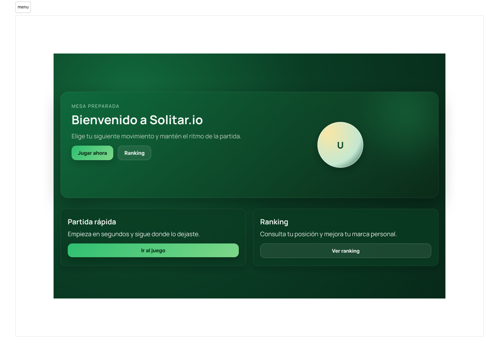
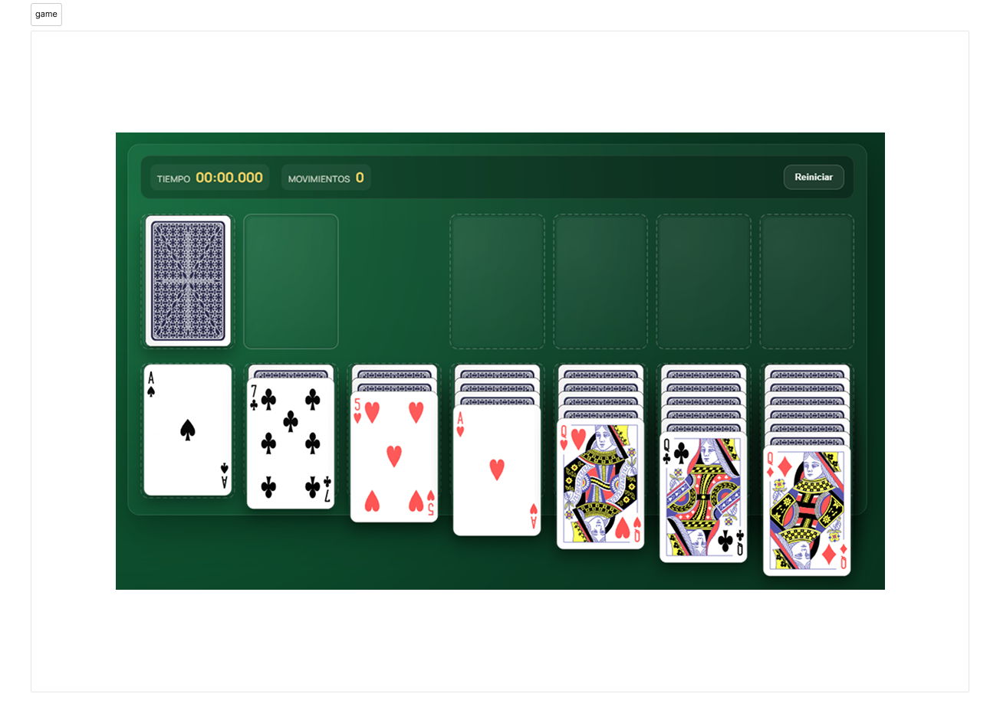

<h1 align="center">Solitario ♠️♥️♦️</h1>

<p align="center">
  <a href="http://localhost:3000"></a>
  
  
</p>

<br/>

<table>
  <tr>
    <td></td>
    <td></td>
  </tr>
  <tr>
    <td align="center">Menu</td>
    <td align="center">Game</td>
  </tr>
</table>

## Collaborators ✨

<a href="https://github.com/raulgamallo/solitario/graphs/contributors">
  
</a>

---

## Environment

### Dependencies

- Docker

### Variables de entorno (.env)

Has de crear un .env en la raíz del proyecto con las siguientes claves = "valor".

> Si no creas el .env, al iniciar el devcontainer te dará error.

```ini
POSTGRES_USER = "your_username"
POSTGRES_PASSWORD = "your_password"
POSTGRES_DB = "your_database"
JWT_SECRET = "d57267fd698391c096c16b6c3cbb401cb8f5e3d616ce881ee5725c45fa0aba04"
```

Una vez creado el .env has de ejecutar el siguiente comando en la raíz del repositorio:

```powershell
docker compose up
```

Podrás acceder a la app desde [http://localhost:3000](http://localhost:3000)

### Postgres

Si estás creando un entorno nuevo, el container de Postgres se encargará de obtener los valores del .env y crear la base de datos y el usuario y contraseña correspondientes.

[Figma](https://www.figma.com/proto/Jez37MseIWTv0H4kK3Eaj7/solitario?page-id=0%3A1&node-id=3-130872&viewport=298%2C-1072%2C0.59&t=Tz0Yhln0DRCQvLDE-1&scaling=min-zoom&content-scaling=fixed&starting-point-node-id=3%3A209&show-proto-sidebar=1)
